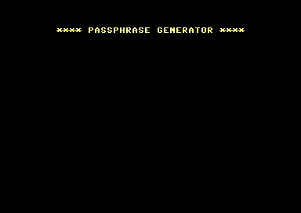

# Commodore EFF Passphrase

[](https://en.wikipedia.org/wiki/Commodore_BASIC)

[](LICENSE)

Generate memorable [EFF Dice-Generated Passphrases](https://www.eff.org/dice) in [Commodore BASIC](https://en.wikipedia.org/wiki/Commodore_BASIC).

Works on the [Commodore 64](https://en.wikipedia.org/wiki/Commodore_64), [Creative Micro Designs SuperCPU64](https://en.wikipedia.org/wiki/SuperCPU), [Commodore 128](https://en.wikipedia.org/wiki/Commodore_128), [Commodore CBM-II](https://en.wikipedia.org/wiki/Commodore_CBM-II), [Commodore PET](https://en.wikipedia.org/wiki/Commodore_PET), [Commodore Plus/4](https://en.wikipedia.org/wiki/Commodore_Plus/4), [Commodore VIC-20](https://en.wikipedia.org/wiki/Commodore_VIC-20), and [Commander X16](https://commanderx16.com).

Written for the [VICE Emulator](https://vice-emu.sourceforge.io) and [Commander X16 Emulator](https://github.com/commanderx16/x16-emulator).

Uses the [EFF short wordlist v2](https://eff.org/files/2016/09/08/eff_short_wordlist_2_0.txt).



## Supported devices

### Commodore devices

| Device (VICE command(s))                      | BASIC Version | Program File                         |
|-----------------------------------------------|---------------|--------------------------------------|
| Commodore 64 (`x64` or `x64sc` or `x64dtv`)   | V2.0          | [bin/c64.prg](bin/c64.prg)           |
| Creative Micro Designs SuperCPU64 (`xscpu64`) | V2.0          | [bin/c64.prg](bin/c64.prg)           |
| Commodore 128 (`x128`)                        | V7.0          | [bin/c128.prg](bin/c128.prg)         |
| Commodore CBM-II (`xcbm2` or `xcbm5x0`)       | V4.0          | [bin/cbm2_pet.prg](bin/cbm2_pet.prg) |
| Commodore PET (`xpet`)                        | V4.0          | [bin/cbm2_pet.prg](bin/cbm2_pet.prg) |
| Commodore Plus/4 (`xplus4`)                   | V3.5          | [bin/plus4.prg](bin/plus4.prg)       |
| Commodore VIC-20 (`xvic`)                     | V2.0          | [bin/vic20.prg](bin/vic20.prg)       |

### Other devices

| Device        | Program File               |
|---------------|----------------------------|
| Commander X16 | [src/x16.bas](src/x16.bas) |

## Warning

- This project is a recreational proof-of-concept to demonstrate how high-entropy passphrases may be generated in Commodore BASIC.
- Random number generators used by Commodore home computers are **not** cryptographically secure.
- If you need dice-generated passphrases for critical applications, follow the directions provided by the [Electronic Frontier Foundation](https://www.eff.org/dice).

## Requirements

- [VICE Emulator](https://vice-emu.sourceforge.io) or [Commander X16 Emulator](https://github.com/commanderx16/x16-emulator)
- Optional: Python 2/3 for generating BASIC code.
- Optional: [petcat](https://vice-emu.sourceforge.io/vice_16.html) for compiling BASIC code.

## Usage

### VICE Emulator

#### Additional setup for VIC-20 (`xvic`)

Skip this step if you are not using the VIC-20 (`xvic`).

Commodore VIC-20 requires memory expansion before the program can be loaded into the machine.

In VICE, go to

- **Preferences** &rarr; **Settings**
- **Machine** &rarr; **Model**
- **Memory expansions** &rarr; **Common configurations** &rarr; **All (block0/1/2/3/5)**

Then perform a hard reset

- **File** &rarr; **Reset** &rarr; **Hard reset**

#### Run in VICE Emulator

If you are using the VIC-20 (`xvic`), ensure that you have completed the aforementioned additional setup before proceeding.

In VICE, go to

- **File** &rarr; **Smart attach ...**
- Choose the appropriate `.prg` program file from this repository. See [Supported Devices](#supported-devices).
- **Autostart**
- Enter number of words to generate (3-20)

### Commander X16 Emulator

In the terminal, run the following

```bash
x16emu -bas x16.bas -run
```

## Development

### Generate BASIC code and compile to PRG format

```bash
make build
```

## Acknowledgements

GOTO with calculated expressions hack for Commodore 64 by [Frithjof Dau](https://lemon64.com/forum/viewtopic.php?t=56869), published on DATA WELT magazine issue 4/85.

## Useful links

- <https://commodore.ca>
- <https://lemon64.com>
- <https://c64-wiki.com>
